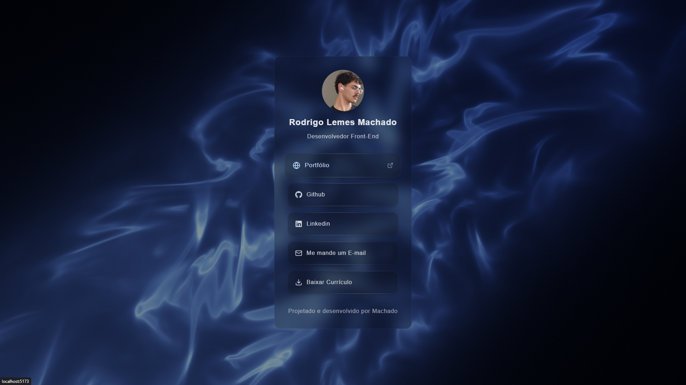

# Linktree Pessoal

Página de links personalizada com foco em aprendizagem de novas tecnologias e funções.
https://linktree-machado.vercel.app/

## Demonstração Visual

## Funcionalidades

- Centralização de links de redes sociais e projetos.

- Fundo interativo com animação de partículas.

- Design 100% responsivo (otimizado para smartphones e computadores).

- Ícones vetoriais otimizados para rápida visualização.

- Arquitetura modular e componentizada para fácil manutenção.

## Tecnologias

- React (Biblioteca principal).

- Tailwind CSS (Estilização e responsividade).

- tsParticles (Animações e efeitos interativos de fundo).

- lucide-react e react-icons (Ícones das redes sociais e ações).

## Aprendizados

- Maior familiaridade com React

- Aprendizado de Tailwind CSS

- Melhor estruturação e entendimento da organização de pastas e arquivos.

- Utilização de biblioteca gráfica.

- Centralização de dados resultando na melhor gestão das informações e maior facilidade de atualização.
